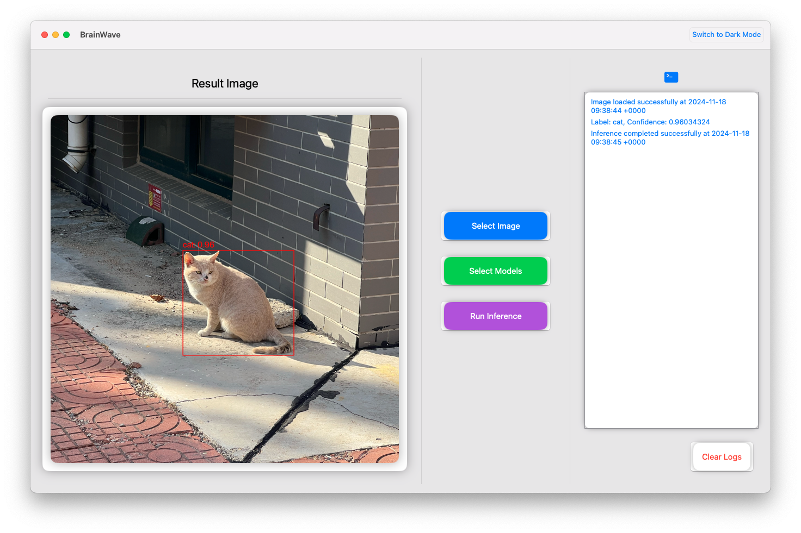

# BrainWave - macOS Deep Learning Object Detection Tool

## Introduction

**BrainWave** is a macOS deep learning object detection tool designed to help developers and researchers quickly load and run deep learning models for object detection tasks. The app supports only **`.mlmodelc`** format CoreML models and provides an intuitive graphical user interface where users can easily select a model and perform inference.

## Features

### 1. Manually Select Object Detection Models

Users can manually select **`.mlmodelc`** format pre-trained object detection models via the simple interface. The app supports loading locally stored CoreML model files, allowing users to choose different detection models to perform tasks.

### 2. Manually Execute Inference

After selecting a model, users can upload an image and manually trigger inference. The inference process runs in the background, providing real-time feedback on progress and results. Once completed, the system displays the detected objects, including their positions, class labels, and confidence scores.

### 3. Render Detection Results

Once inference is complete, the system will render the detected objects and their respective labels onto the user interface:
- **Bounding Boxes**: Highlighted bounding boxes around detected objects.
- **Class Labels and Confidence Scores**: Displayed next to each detected object showing its class label and confidence score.

### 4. Interactive Interface

BrainWave provides an intuitive, user-friendly graphical interface that does not require any coding. Users can easily select models, upload images, and perform object detection inference with simple clicks and drag-and-drop actions.

## Installation

### System Requirements

- macOS 10.15 or later

### Installation Steps

1. Clone the project to your local machine:
   ```bash
   git clone https://github.com/Ravenwell-Lui/BrainWave.git
   ```

2. Navigate to the project directory:
   ```bash
   cd BrainWave
   ```

3. Launch the macOS client:
   The macOS client is already bundled with the project, and you can launch it by running:
   ```bash
   open BrainWave.app
   ```

## Usage

### 1. Launch the Application

After starting the app, you will see a clean interface where you can perform the following actions:

- **Select Model**: Click the "Select Model" button to browse and choose a **.mlmodelc** format object detection model file.
- **Upload Input Image**: Click the "Choose Image" button to upload an image file for object detection.
- **Execute Inference**: Click the "Start Inference" button to automatically load the selected model and run inference.

### 2. View Inference Results

Once the inference is complete, the system will display:
- **Bounding Boxes**: Each detected object will have its bounding box drawn around it in the image.
- **Class Labels and Confidence**: Each detected object will display its class label and confidence score next to it.

## Supported Model Format

- **CoreML Models**: Only **`.mlmodelc`** format object detection models are supported.

## Example

### Selecting a Model

Choose a **`.mlmodelc`** format object detection model, then click "Start Inference" to begin.

### Performing Inference

Upload an image, and the system will use the selected object detection model to perform inference. Detected objects will be displayed with bounding boxes, along with their class labels and confidence scores.

## Contributing

If you would like to contribute to this project, feel free to submit Issues or Pull Requests. Please ensure that your code follows proper formatting guidelines and runs all tests before submitting.

## License

This project is licensed under the MIT License. See [LICENSE](LICENSE) for more details.
